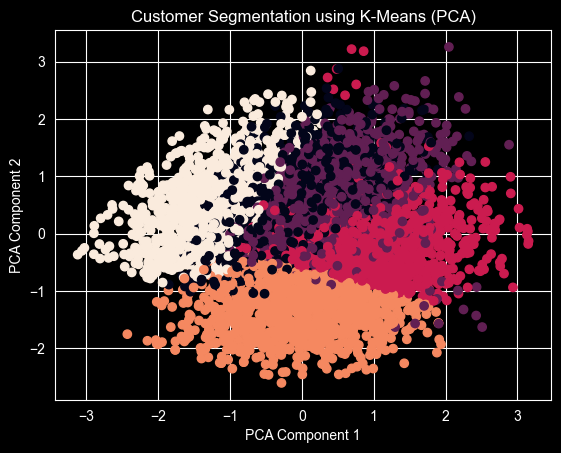
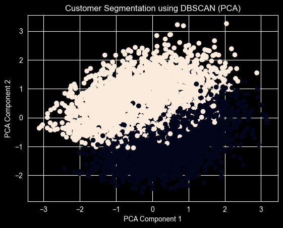

# Customer-Segmentation-Using-Clustering

- Project Overview

This project focuses on segmenting customers into meaningful groups based on demographic and behavioral features using unsupervised machine learning techniques. The aim is to understand customer purchasing behavior and derive insights that can support better marketing and business decisions.

Customer segmentation helps organizations identify high-value customers, low-engagement customers, and price-sensitive customers, allowing them to design targeted strategies instead of applying a one-size-fits-all approach.

---

## Problem Statement
Many businesses struggle to personalize their marketing efforts because customer behavior varies significantly. The goal of this project is to group customers with similar characteristics and spending patterns so that businesses can make data-driven decisions for customer engagement and retention.

---

## Dataset Description
The dataset contains 5000 customer records with the following features:
- Gender
- Age
- Annual Income (k$)
- Spending Score (1–100)

The spending score is a relative metric that represents customer purchasing behavior. Lower values indicate minimal spending activity, while higher values represent frequent and high-value purchases.

---

## Methodology

### Data Preprocessing
- Removed irrelevant columns such as customer identifiers
- Converted categorical variables into numerical format
- Applied feature scaling using StandardScaler to ensure all features contribute equally

### Clustering Techniques
- K-Means clustering was applied after determining the optimal number of clusters using the Elbow Method
- DBSCAN was used to identify dense customer groups and detect noise points representing extremely low-engagement customers

### Dimensionality Reduction
Principal Component Analysis (PCA) was used to reduce the feature space to two dimensions for visualization and better interpretation of clusters.

### Model Evaluation
Clustering performance was evaluated using the Silhouette Score. A moderate score was observed due to overlapping real-world customer behaviors, which is common in marketing datasets.

---

## Results
- K-Means successfully identified distinct customer segments
- DBSCAN identified outliers and low-density regions in the data
- PCA visualizations helped in understanding cluster separation and overlap

---

## Business Insights
- High-spending customer groups can be targeted with loyalty programs and personalized offers
- Price-sensitive customers can be approached with discount-based strategies
- Low-engagement customers can be identified for re-engagement campaigns or reduced marketing investment

---

## 📊 Visualizations

### K-Means Clustering (PCA)

### DBSCAN Clustering (PCA)

## Key Learnings
- Real-world customer data rarely forms perfectly separated clusters
- Business interpretation is more important than maximizing clustering metrics
- Unsupervised learning techniques are effective for exploratory data analysis

